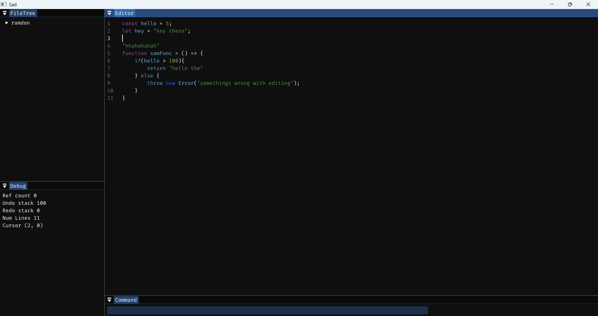

# sad

A simple text editor written in C++ using ImGui

It looks like this

## Features
We are at a very basic stage so lower you expectations
- Simple Cursor navigation
- Simple selection
- Basic Keybindings system
- Cut/Copy/Paste
- Cursor position aware Undo/Redo
- Basic syntax highlighting

## TODO
- Multi cursor
- Undo/Redo system
  - We are using line diff, maybe more specific diff?
  - A better way of start/end transactions, dont want to write it everywhere
- Selecting by clicking/dragging
- Actually save the file
- Edit multiple files simultaneously (optional)
- Better UI styling
- fix alignment issue due to `\r \n \t`
- Text wrapping
- Handle gigantic files
- Handle line number better
- Command system
  - we could use [sol2](https://github.com/ThePhD/sol2)
- Syntax highlighting
  - Preferably based on active mode
  - comments not working
  - regex is kind of dumb soemtimes it gets stack overflow error

## Reference
- [How Emacs modes work?](https://www.emacswiki.org/emacs/ModeTutorial)
- [TextMate Grammar](https://macromates.com/manual/en/language_grammars)
- [Sublime Text Syntax Definitions](https://www.sublimetext.com/docs/syntax.html)
- [sol2](https://github.com/ThePhD/sol2)